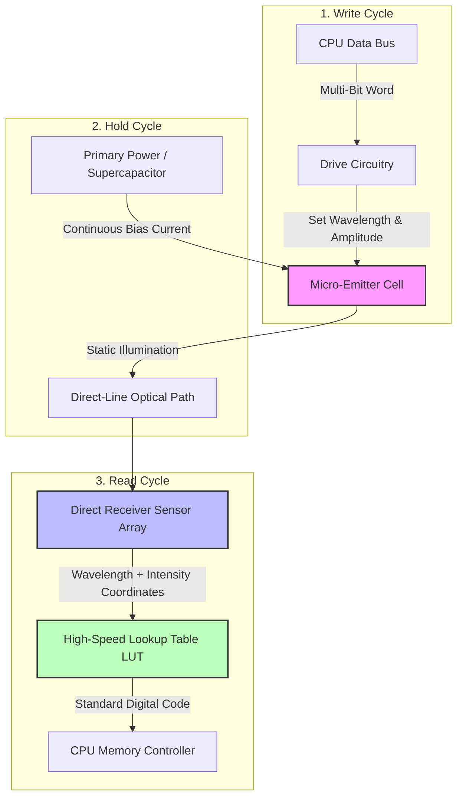

 *
# Color-Amplitude Modulated Photonic Random Access Memory (CAM-PRAM)
**Docket Reference:** CAM-PRAM-001  
**Classification:** Solid-State Memory / Silicon Photonics / Non-Charge-Based Data Storage  
**Development Stage:** Architectural Concept & Pre-Filing Technical Disclosure  

---

## 📌 Technical Abstract
**CAM-PRAM** is a novel photonic memory architecture designed to eliminate reliance on conventional binary charge-trap or capacitive-charge storage mechanisms found in traditional Dynamic Random Access Memory (DRAM). 

Instead of a standard transistor-capacitor pair, each memory cell utilizes a micro-scale emissive source positioned in a direct-line optical alignment with a co-located multi-wavelength photodetector. Rather than encoding a single binary bit through the presence or absence of electrical charge, the system encodes a high-density, multi-bit data word by driving the cell to a specific combination of **emission wavelength (color)** and **luminous amplitude (brightness)**. 

---

## ⏱️ Latency & Time-of-Flight Formalisms

The total access latency ($\tau_{total}$) of the CAM-PRAM cell architecture is completely decoupled from the $RC$ time constants (capacitive charging constraints) inherent to electrical DRAM. Total latency is defined as:

$$\tau_{total} = \tau_{driver} + \tau_{e\to o} + \tau_{prop} + \tau_{o\to e} + \tau_{LUT}$$

Where:
* **$\tau_{driver}$**: Internal propagation delay of the multi-level drive circuitry.
* **$\tau_{e\to o}$**: Electro-optic conversion latency (carrier injection time of the microscopic emitter).
* **$\tau_{prop}$**: Optical time-of-flight through the direct-line medium, dictated by the effective refractive index ($n_{eff}$) and physical path distance ($L$):
  $$\tau_{prop} = \frac{n_{eff} \cdot L}{c}$$
* **$\tau_{o\to e}$**: Optoelectronic conversion response time of the receiving sensor array.
* **$\tau_{LUT}$**: Static combinatorial logic delay of the multi-bit lookup table.

Because $L \approx 10^{-6}\text{ m}$ (micrometer scale) within a face-to-face co-packaged foundry node, the physical time-of-flight ($\tau_{prop}$) scales down to the low femtosecond regime, making electronic driver switching speed the primary latency bottleneck.

---

## ⚡ Real-World Engineering Constraints & Mitigations

### 1. Thermal Drift & Wavelength Calibration
* **The Challenge:** Semiconductor emitters exhibit red-shifting (wavelength changes) and intensity degradation as junction temperatures rise under heavy workloads.
* **The Architecture:** CAM-PRAM implements localized Thermo-Optic Tuning Loops and integrated reference calibration cells. The high-speed Lookup Table (LUT) dynamically recalibrates its coordinate mapping relative to a baseline reference cell on the same thermal plane, preventing data corruption from temperature fluctuations.

### 2. Static Power Management
* **The Challenge:** Statically driving millions of active emitters continuously generates significant power overhead compared to passive capacitors.
* **The Architecture:** To maximize efficiency, CAM-PRAM introduces an **Active Zone Gating** protocol. Emitter blocks are only held in fully illuminated states when mapping active working sets. Inactive blocks drop to a ultra-low bias current sleep state, using a fast-recovery burst sequence to restore state information upon memory page awakening.

---

## 📐 Project Structure
* `/hardware`: Contains Python geometric scripting utilizing `gdsfactory` to generate industry-standard layouts.
* `/docs`: Expanded whitepapers regarding structural defect tolerances and CMOS compatibility.
* `/simulations`: Basic script pipelines targeting open-source FDTD software (such as MIT's Meep) for light wave propagation mapping.

---

## 📜 Licensing
This project is open-sourced under the **MIT License**. Feel free to audit, branch, or build upon the architecture.

